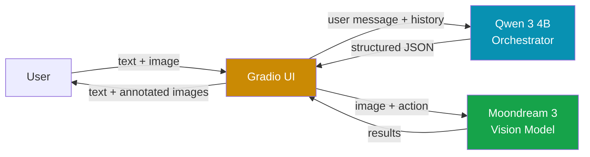
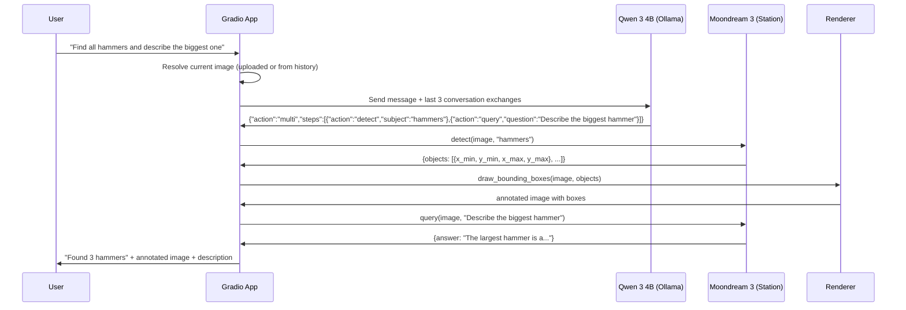
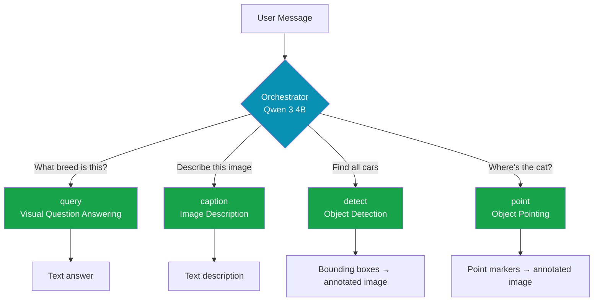
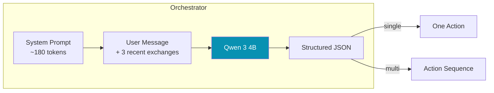

# Moondream Chat

A conversational interface for visual understanding. Upload an image, ask questions, find objects, get descriptions — all running locally on your machine with no data leaving your computer.

Two AI models work together: [Moondream 3](https://moondream.ai/blog/moondream-3-preview) handles vision tasks (understanding images, detecting objects, reading text), while [Qwen 3 4B](https://ollama.com/library/qwen3:4b) acts as a language orchestrator that interprets what you're asking for and routes to the right capability.


---

## Architecture Overview

The system uses a two-model architecture. This separation exists because vision models are great at seeing but not great at understanding conversational nuance, while language models are great at parsing intent but can't see images. By combining them, we get the best of both.



**Qwen 3 4B** (via [Ollama](https://ollama.com)) is the orchestrator. It receives the user's natural language message along with recent conversation history, and returns structured JSON specifying which vision capability to invoke. It handles ambiguous references ("what is it?"), compound requests ("find the cars and describe the red one"), and natural phrasing that a regex parser would miss. It runs in `/no_think` mode with low temperature for fast, deterministic classification — typically responding in under 500ms.

**Moondream 3** (via [Moondream Station](https://docs.moondream.ai/station/)) is the vision model. It's a 9-billion-parameter Mixture-of-Experts model that activates roughly 2 billion parameters per inference, keeping it fast despite its size. It supports four distinct capabilities: visual question answering, image captioning, object detection with bounding boxes, and object pointing with center coordinates. On Apple Silicon, Station uses MLX for native acceleration.

If Ollama isn't running, the system gracefully degrades to a built-in regex-based intent parser. You lose context resolution and multi-step support, but single queries still work fine.

## Request Flow

Here's what happens when you type a message:



The orchestrator is the key piece that makes compound requests like this work. Without it, "find all hammers and describe the biggest one" would just go to a single query call and return a text answer with no bounding boxes.

## The Four Vision Capabilities

Moondream 3 exposes four distinct API methods, each returning a different type of data. The orchestrator picks the right one based on what you're asking.



**Query** is the most flexible — it handles any natural language question about the image and uses Moondream 3's reasoning mode to "think" before answering. Good for complex or nuanced questions.

**Caption** generates a text description at three levels of detail: short (one-liner), normal (a sentence or two), or long (detailed paragraph). The orchestrator picks the length based on how you phrase it ("brief description" → short, "describe in detail" → long).

**Detect** finds all instances of a given object and returns bounding box coordinates normalized to 0–1. The renderer converts these to pixel coordinates and draws semi-transparent colored rectangles on a copy of the image. Each box gets a label, and colors cycle through 8 distinct values when multiple objects are found.

**Point** locates objects by their center point, also normalized to 0–1. The renderer draws crosshair markers with contrasting rings (white outer, red inner) so they're visible on any background. Useful when you want precise location rather than a bounding region.

All coordinates from Moondream are normalized — values between 0 and 1, where (0,0) is top-left and (1,1) is bottom-right. The renderer handles the conversion to actual pixel positions based on the image dimensions.

## How the Orchestrator Works

The orchestrator sends a lean system prompt (~180 tokens) to Qwen 3 4B with few-shot examples that teach the JSON output format. Ollama's structured output feature constrains the response to match a predefined JSON schema, so parsing never fails.



The system prompt is intentionally small. Research shows that small models (1–4B parameters) degrade significantly with long system prompts due to attention dilution — the more instructions you stuff in, the worse the model follows any of them. Instead of verbose rules, the prompt uses few-shot examples that demonstrate the pattern. The model learns the mapping from natural language to structured actions by seeing examples rather than reading explanations.

Conversation history is limited to the last 6 messages (3 exchanges). This gives the model enough context to resolve references like "it" or "that one" without overloading its context window. Only text content is passed — images are stripped since the orchestrator doesn't need to see them.

When Ollama is unreachable (connection refused or timeout), the orchestrator falls back to `intent.py`, a regex-based parser that handles simple single-action routing. You lose context resolution and multi-step support, but the app stays functional.

## Image Persistence

You don't need to re-upload the image with every message. The app maintains image context across the conversation:

1. If you upload an image with your message, that becomes the current image.
2. If you send text without an image, the app searches backward through the chat history to find the most recent uploaded image.
3. If no image exists anywhere, you get a friendly prompt to upload one.

This means you can upload once, then ask 10 different questions about the same image. Upload a new image at any time to switch context.

## Terminal Logging

Every request flow is logged to the terminal with colored output using [loguru](https://github.com/Delgan/loguru). Each component gets its own tag so you can trace the full pipeline:

```
18:42:01 [APP] New message: "find all hammers" (1 file(s))
18:42:01 [APP] Loaded uploaded image: 1920x1080
18:42:01 [ORCHESTRATOR] User message: "find all hammers"
18:42:01 [ORCHESTRATOR] Sending to qwen3:4b via Ollama...
18:42:02 [ORCHESTRATOR] LLM response: {"action":"detect","subject":"hammers"}
18:42:02 [ORCHESTRATOR] Action 1: detect | subject=hammers
18:42:02 [MOONDREAM] detect("hammers")
18:42:03 [MOONDREAM] detect result (842ms): found 2 object(s)
18:42:03 [APP] Returning 2 message(s) to chat
```

For even more visibility into what Ollama is doing (token generation speed, model loading, memory usage), start Ollama in debug mode:

```bash
OLLAMA_DEBUG=1 ollama serve
```

## Prerequisites

You need two local services running before starting the app:

**1. Moondream Station** — the vision model server

```bash
pip install moondream-station
moondream-station
```

First run downloads the model weights (quantized, a few GB). After that it starts in seconds. Runs on `localhost:2020`.

**2. Ollama with Qwen 3 4B** — the language orchestrator

```bash
# Install Ollama: https://ollama.com
ollama pull qwen3:4b
ollama serve
```

Runs on `localhost:11434`. If you skip this step, the app still works using the regex fallback — just without smart intent parsing.

For more details: [Moondream Station docs](https://docs.moondream.ai/station/) · [Ollama docs](https://ollama.com)

## Setup

Clone the repo and install dependencies with [uv](https://docs.astral.sh/uv/):

```bash
git clone https://github.com/your-username/better_moondream_demo.git
cd better_moondream_demo
uv sync
```

If you don't have uv:

```bash
curl -LsSf https://astral.sh/uv/install.sh | sh
```

## Running

Three terminals:

```bash
# Terminal 1: Vision model
moondream-station

# Terminal 2: Language orchestrator
ollama serve

# Terminal 3: The app
uv run python main.py
```

Opens at `http://localhost:7860`. Upload an image and start chatting.

## Example Conversations

| You type | What happens |
|---|---|
| *(just upload, no text)* | Auto-generates a description |
| "What's happening in this photo?" | Visual QA with reasoning |
| "Describe this image in detail" | Long-form caption |
| "Give me a short caption" | Brief one-liner |
| "Find all people" | Bounding boxes drawn around each person |
| "How many cars are there?" | Detection with count |
| "Where's the dog?" | Crosshair marker on the dog |
| "Point to the red button" | Precise location marker |
| "Find the tools and describe the biggest one" | Multi-step: detect + query |
| "What is it?" *(after discussing a hammer)* | Context-aware follow-up |

## Project Structure

```
better_moondream_demo/
├── main.py               Entry point
├── pyproject.toml         Dependencies and project config
├── README.md
├── .gitignore
└── src/
    ├── __init__.py
    ├── app.py             Gradio chat interface, wires everything together
    ├── orchestrator.py    LLM-powered intent parsing via Ollama
    ├── client.py          Moondream Station client wrapper
    ├── intent.py          Regex fallback parser (used when Ollama is down)
    ├── renderer.py        Draws bounding boxes and point markers on images
    └── logger.py          Loguru-based colored terminal logging
```

## Dependencies

| Package | Purpose |
|---|---|
| [gradio](https://gradio.app) | Chat interface with multimodal input |
| [moondream](https://pypi.org/project/moondream/) | Python client for the Moondream vision API |
| [moondream-station](https://pypi.org/project/moondream-station/) | Local vision model inference server |
| [requests](https://docs.python-requests.org/) | HTTP client for Ollama API |
| [loguru](https://github.com/Delgan/loguru) | Colored structured logging |
| [Pillow](https://python-pillow.org/) | Image loading and annotation drawing |

Ollama is installed separately (not a Python dependency) — see [ollama.com](https://ollama.com).

## About the Models

### Moondream 3

A 9B-parameter Mixture-of-Experts vision-language model. It dynamically routes tokens across 64 experts, activating only 8 per inference. This keeps latency low while maintaining high accuracy. It has a 32K context window and uses a SigLIP-based vision encoder with multi-crop channel concatenation for token-efficient high-resolution image processing.

On Apple Silicon, Moondream Station uses MLX for native acceleration with quantized weights. You need at least 16GB of unified memory.

[Model announcement](https://moondream.ai/blog/moondream-3-preview) · [HuggingFace weights](https://huggingface.co/moondream/moondream3-preview) · [Documentation](https://docs.moondream.ai/)

### Qwen 3 4B

A 4B-parameter language model from Alibaba's Qwen team. Used here purely as an intent classifier and orchestrator — it never sees the images. It was chosen for this role because of its strong structured output capabilities and dual-mode architecture (thinking/non-thinking). We use non-thinking mode for fast deterministic classification.

[Ollama page](https://ollama.com/library/qwen3:4b)

## License

MIT
