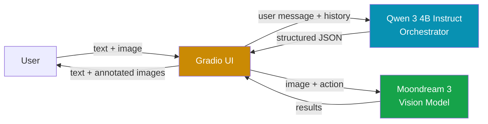
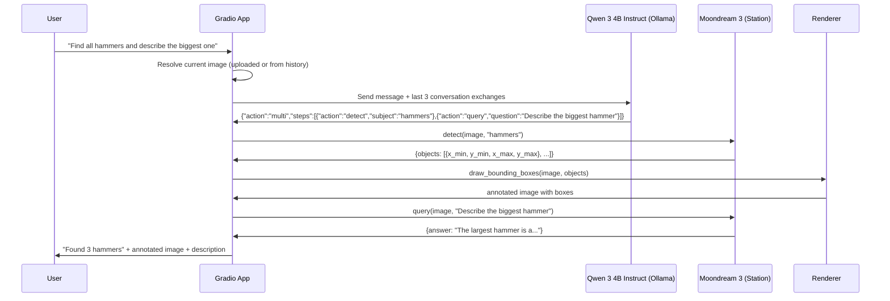
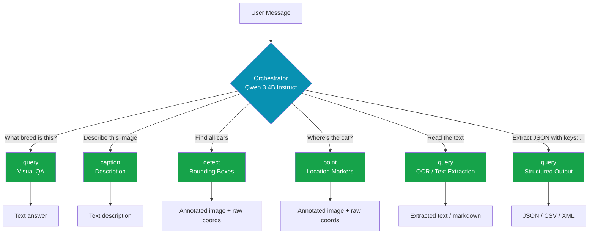
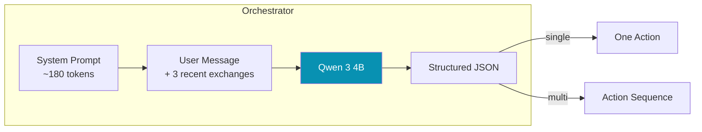

# Moondream Chat

| Description | Object Detection | Object Detection | Object Pointing |
| --- | --- | --- | --- |
|  |  |  |  |

A conversational interface for visual understanding. Upload an image, ask questions, find objects, get descriptions — all running locally on your machine with no data leaving your computer.

Two AI models work together: [Moondream 3](https://moondream.ai/blog/moondream-3-preview) handles vision tasks (understanding images, detecting objects, reading text), while [Qwen 3 4B Instruct](https://ollama.com/library/qwen3:4b-instruct-2507-q4_K_M) acts as a language orchestrator that interprets what you're asking for and routes to the right capability.


---

## Architecture Overview

The system uses a two-model architecture. This separation exists because vision models are great at seeing but not great at understanding conversational nuance, while language models are great at parsing intent but can't see images. By combining them, we get the best of both.



**Qwen 3 4B Instruct** (via [Ollama](https://ollama.com)) is the orchestrator. It receives the user's natural language message along with recent conversation history, and returns structured JSON specifying which vision capability to invoke. It handles ambiguous references ("what is it?"), compound requests ("find the cars and describe the red one"), and natural phrasing that a regex parser would miss. It runs with low temperature for fast, deterministic classification — typically responding in under 500ms.

> [!IMPORTANT]
> We use the **instruct** variant (`qwen3:4b-instruct-2507-q4_K_M`), not the default `qwen3:4b`. The default Qwen 3 model uses a "thinking" mode that conflicts with Ollama's structured JSON output, producing empty responses. The instruct variant skips chain-of-thought and gives direct, schema-compliant output. See [ollama/ollama#10929](https://github.com/ollama/ollama/issues/10929) and [ollama/ollama#12917](https://github.com/ollama/ollama/issues/12917) for background.

**Moondream 3** (via [Moondream Station](https://docs.moondream.ai/station/)) is the vision model. It's a 9-billion-parameter Mixture-of-Experts model that activates roughly 2 billion parameters per inference, keeping it fast despite its size. It supports four distinct capabilities: visual question answering, image captioning, object detection with bounding boxes, and object pointing with center coordinates. On Apple Silicon, Station uses MLX for native acceleration.

If Ollama isn't running, the system gracefully degrades to a built-in regex-based intent parser. You lose context resolution and multi-step support, but single queries still work fine.

## Request Flow

Here's what happens when you type a message:



The orchestrator is the key piece that makes compound requests like this work. Without it, "find all hammers and describe the biggest one" would just go to a single query call and return a text answer with no bounding boxes.

## Vision Capabilities

Moondream 3 exposes four distinct API methods, plus powerful prompt-driven features like OCR and structured output. The orchestrator picks the right approach based on what you're asking.



**Query** is the most flexible — it handles any natural language question about the image. By default it uses Moondream 3's reasoning mode, where the model "thinks" before answering. The orchestrator disables reasoning for simple factual questions (like "what color is the sky?") to save time.

**Caption** generates a text description at three levels of detail: short (one-liner), normal (a sentence or two), or long (detailed paragraph). The orchestrator picks the length based on how you phrase it ("brief description" → short, "describe in detail" → long).

**Detect** finds all instances of a given object and returns bounding box coordinates normalized to 0–1. The renderer converts these to pixel coordinates and draws semi-transparent colored rectangles on a copy of the image. Each box gets a label, and colors cycle through 8 distinct values when multiple objects are found. Raw coordinate data is shown in a collapsible block below the annotated image.

**Point** locates objects by their center point, also normalized to 0–1. The renderer draws crosshair markers with contrasting rings (white outer, red inner) so they're visible on any background. Useful when you want precise location rather than a bounding region. Raw point data is also shown in a collapsible block.

**OCR & Text Extraction** — Moondream 3 has strong OCR capabilities. Ask "read the text", "OCR this", or "what does the sign say?" and the orchestrator routes to query with reasoning disabled for fast extraction. You can also ask "convert to markdown" to get formatted output from tables, documents, or screenshots.

**Structured Output** — Moondream 3 natively generates JSON, CSV, XML, and markdown when you include the format in your prompt. Ask "extract a JSON array with keys: name, color, position" and it returns structured data directly. This is handled via query — Moondream parses the prompt format instructions itself.

> [!TIP]
> For detect and point results, expand the "Raw data" section below the annotated image to see the exact normalized coordinates returned by Moondream. This is useful for building on top of the API or debugging detection accuracy.

All coordinates from Moondream are normalized — values between 0 and 1, where (0,0) is top-left and (1,1) is bottom-right. The renderer handles the conversion to actual pixel positions based on the image dimensions.

## How the Orchestrator Works

The orchestrator sends a lean system prompt to Qwen 3 4B Instruct with few-shot examples that teach the JSON output format — including OCR, structured output, and reasoning flag examples. Ollama's structured output feature constrains the response to match a predefined JSON schema, so parsing never fails.



The system prompt is intentionally small. Research shows that small models (1–4B parameters) degrade significantly with long system prompts due to attention dilution — the more instructions you stuff in, the worse the model follows any of them. Instead of verbose rules, the prompt uses few-shot examples that demonstrate the pattern. The model learns the mapping from natural language to structured actions by seeing examples rather than reading explanations.

Conversation history is limited to the last 6 messages (3 exchanges). This gives the model enough context to resolve references like "it" or "that one" without overloading its context window. Only text content is passed — images are stripped since the orchestrator doesn't need to see them.

### Regex Fallback (`intent.py`)

When Ollama is unreachable (connection refused or timeout), the orchestrator automatically falls back to [`src/intent.py`](src/intent.py), a regex-based parser. This keeps the app functional without any external LLM dependency — you just lose the smarter features.

The fallback checks patterns in a fixed priority order — first match wins:

1. **Caption** — triggers on keywords like `describe`, `caption`, `what's in this image`, `tell me about this photo`. Also detects length modifiers (`brief` → short, `detailed` → long).
2. **Detect** — triggers on `find all X`, `detect X`, `where are the X`, `how many X`, `count X`. Extracts the subject from the matched group (e.g., "find all **cars**" → subject is `cars`).
3. **Point** — triggers on `point to X`, `where's the X`, `show me the X`. Extracts a singular subject.
4. **Query** — catch-all fallback. Any message that doesn't match the above patterns goes to Moondream's visual QA as a direct question.

> [!NOTE]
> The regex parser has no conversation memory, so context-dependent messages like "what is it?" will go straight to query without resolving "it". It also can't handle compound requests ("find the cars and describe the red one" would match detect only). These limitations are exactly why we added the LLM orchestrator.

## Image Persistence

You don't need to re-upload the image with every message. The app maintains image context across the conversation:

1. If you upload an image with your message, that becomes the current image.
2. If you send text without an image, the app searches backward through the chat history to find the most recent uploaded image.
3. If no image exists anywhere, you get a friendly prompt to upload one.

This means you can upload once, then ask 10 different questions about the same image. Upload a new image at any time to switch context.

## Terminal Logging

Every request flow is logged to the terminal with colored output using [loguru](https://github.com/Delgan/loguru). Each component gets its own tag so you can trace the full pipeline:

```
18:42:01 [APP] New message: "find all hammers" (1 file(s))
18:42:01 [APP] Loaded uploaded image: 1920x1080
18:42:01 [ORCHESTRATOR] User message: "find all hammers"
18:42:01 [ORCHESTRATOR] Sending to qwen3:4b-instruct-2507-q4_K_M via Ollama...
18:42:02 [ORCHESTRATOR] LLM response: {"action":"detect","subject":"hammers"}
18:42:02 [ORCHESTRATOR] Action 1: detect | subject=hammers
18:42:02 [MOONDREAM] detect("hammers")
18:42:03 [MOONDREAM] detect result (842ms): found 2 object(s)
18:42:03 [APP] Returning 2 message(s) to chat
```

For even more visibility into what Ollama is doing (token generation speed, model loading, memory usage), start Ollama in debug mode:

```bash
OLLAMA_DEBUG=1 ollama serve
```

## Prerequisites

You need two local services running before starting the app:

**1. Moondream Station** — the vision model server

```bash
pip install moondream-station
moondream-station
```

First run downloads the model weights (quantized, a few GB). After that it starts in seconds. Runs on `localhost:2020`.

**2. Ollama with Qwen 3 4B Instruct** — the language orchestrator

```bash
# Install Ollama: https://ollama.com
ollama pull qwen3:4b-instruct-2507-q4_K_M
ollama serve
```

> [!WARNING]
> Do **not** use `ollama pull qwen3:4b` — that pulls the thinking variant which produces empty JSON responses when used with structured output. Always use the instruct variant above.

Runs on `localhost:11434`. If you skip this step, the app still works using the regex fallback — just without smart intent parsing.

For more details: [Moondream Station docs](https://docs.moondream.ai/station/) · [Ollama docs](https://ollama.com)

## Setup

Clone the repo and install dependencies with [uv](https://docs.astral.sh/uv/):

```bash
git clone https://github.com/your-username/better_moondream_demo.git
cd better_moondream_demo
uv sync
```

If you don't have uv:

```bash
curl -LsSf https://astral.sh/uv/install.sh | sh
```

## Configuration

All settings live in [`config.yaml`](config.yaml) at the project root. Edit it to change endpoints, models, ports, or theme without touching Python code:

```yaml
moondream:
  endpoint: "http://localhost:2020/v1"

ollama:
  url: "http://localhost:11434"
  model: "qwen3:4b-instruct-2507-q4_K_M"
  temperature: 0.1
  num_predict: 256
  timeout: 30

app:
  host: "0.0.0.0"       # LAN-accessible by default
  port: 7860
  theme: "hmb/amethyst"
  share: false
```

Every key has a sensible default — the app runs fine even if `config.yaml` is missing.

## Running

Three terminals:

```bash
# Terminal 1: Vision model
moondream-station

# Terminal 2: Language orchestrator
ollama serve

# Terminal 3: The app
uv run python main.py
```

By default it binds to `0.0.0.0:7860`, so it's accessible from other devices on your LAN. Override with CLI flags:

```bash
uv run python main.py --port 8080
uv run python main.py --host 127.0.0.1 --port 9000
```

CLI flags take priority over `config.yaml` values.

## Example Conversations

| You type | What happens |
|---|---|
| *(just upload, no text)* | Auto-generates a description |
| "What's happening in this photo?" | Visual QA with reasoning enabled |
| "What color is the sky?" | Visual QA with reasoning disabled (fast) |
| "Describe this image in detail" | Long-form caption |
| "Give me a short caption" | Brief one-liner |
| "Find all people" | Bounding boxes + raw coordinate data |
| "How many cars are there?" | Detection with count + collapsible coordinates |
| "Where's the dog?" | Crosshair marker + raw point data |
| "Point to the red button" | Precise location marker |
| "Read all the text in this image" | OCR text extraction |
| "Convert to markdown" | OCR with markdown formatting (tables, headings) |
| "Extract a JSON array with keys: name, color" | Structured JSON output |
| "What does the sign say?" | Quick text reading (no reasoning) |
| "Find the tools and describe the biggest one" | Multi-step: detect + query |
| "What is it?" *(after discussing a hammer)* | Context-aware follow-up |

## Project Structure

```
better_moondream_demo/
├── main.py               Entry point with CLI args (--host, --port)
├── config.yaml           All configurable settings (endpoints, models, ports)
├── pyproject.toml         Dependencies and project config
├── README.md
├── .gitignore
└── src/
    ├── __init__.py
    ├── config.py          YAML config loader with defaults
    ├── app.py             Gradio chat interface, wires everything together
    ├── orchestrator.py    LLM-powered intent parsing via Ollama
    ├── client.py          Moondream Station client wrapper
    ├── intent.py          Regex fallback parser (used when Ollama is down)
    ├── renderer.py        Draws bounding boxes and point markers on images
    └── logger.py          Loguru-based colored terminal logging
```

## Dependencies

| Package | Purpose |
|---|---|
| [gradio](https://gradio.app) | Chat interface with multimodal input |
| [moondream](https://pypi.org/project/moondream/) | Python client for the Moondream vision API |
| [moondream-station](https://pypi.org/project/moondream-station/) | Local vision model inference server |
| [requests](https://docs.python-requests.org/) | HTTP client for Ollama API |
| [loguru](https://github.com/Delgan/loguru) | Colored structured logging |
| [Pillow](https://python-pillow.org/) | Image loading and annotation drawing |
| [PyYAML](https://pyyaml.org/) | Configuration file loading |

Ollama is installed separately (not a Python dependency) — see [ollama.com](https://ollama.com).

## Swapping the Orchestrator Model

The orchestrator model is configured in [`config.yaml`](config.yaml):

```yaml
ollama:
  model: "qwen3:4b-instruct-2507-q4_K_M"
```

To use a different model:

1. Pull it via Ollama: `ollama pull <model-name>`
2. Update `ollama.model` in `config.yaml`
3. Restart the app

> [!NOTE]
> Any Ollama model that supports structured JSON output (the `format` parameter) should work. If you choose a model with a "thinking" mode (like the default `qwen3:4b`), it will likely produce empty responses — pick an instruct/non-thinking variant instead.

The system prompt in `SYSTEM_PROMPT` is tuned to be small (~180 tokens) for 4B-class models. If you swap to a larger model (8B+), you could expand the prompt with more examples or rules without degrading performance.

## About the Models

### Moondream 3

A 9B-parameter Mixture-of-Experts vision-language model. It dynamically routes tokens across 64 experts, activating only 8 per inference. This keeps latency low while maintaining high accuracy. It has a 32K context window and uses a SigLIP-based vision encoder with multi-crop channel concatenation for token-efficient high-resolution image processing.

Key features we use: visual QA with toggleable reasoning mode, image captioning, object detection (bounding boxes), object pointing (center coordinates), OCR/text extraction, and native structured output (JSON, markdown, CSV, XML). The `encode_image()` method lets us encode once and reuse across multiple queries on the same image for better performance.

On Apple Silicon, Moondream Station uses MLX for native acceleration with quantized weights. You need at least 16GB of unified memory.

> [!NOTE]
> Moondream 3 also supports [segmentation](https://docs.moondream.ai/skills/segment/) (SVG path masks), but this is currently a cloud-only preview and not yet available in Moondream Station.

[Model announcement](https://moondream.ai/blog/moondream-3-preview) · [HuggingFace weights](https://huggingface.co/moondream/moondream3-preview) · [Documentation](https://docs.moondream.ai/)

### Qwen 3 4B Instruct

A 4B-parameter language model from Alibaba's Qwen team. Used here purely as an intent classifier and orchestrator — it never sees the images. We use the **instruct variant** (`qwen3:4b-instruct-2507-q4_K_M`) specifically because it produces direct structured output without chain-of-thought reasoning, which is what we need for fast JSON classification.

> [!NOTE]
> Qwen 3 models were split into "thinking" and "instruct" variants after a July 2025 update. The default tag (`qwen3:4b`) points to the thinking variant where `/no_think` and `think: false` [no longer work](https://github.com/ollama/ollama/issues/12917). The instruct variant avoids this entirely.

[Ollama page](https://ollama.com/library/qwen3:4b-instruct-2507-q4_K_M) · [Qwen 3 announcement](https://qwenlm.github.io/blog/qwen3/)

## License

MIT
